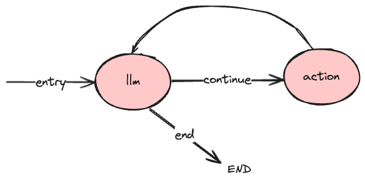

# ZenModel
[](https://goreportcard.com/report/github.com/zenmodel/zenmodel)

[](https://pkg.go.dev/github.com/zenmodel/zenmodel?tab=doc)

[](https://discord.gg/6YhZquB4zb)

[//]: # ([![Sourcegraph]&#40;https://sourcegraph.com/github.com/zenmodel/zenmodel/-/badge.svg&#41;]&#40;https://sourcegraph.com/github.com/zenmodel/zenmodel?badge&#41;)

[//]: # ([![Release]&#40;https://img.shields.io/github/release/zenmodel/zenmodel.svg?style=flat-square&#41;]&#40;https://github.com/zenmodel/zenmodel/releases&#41;)

[中文](./README_zh.md) | [English](./README.md)

***使用 Golang 开发 Agentic 大模型应用***

## 概述

[ZenModel](https://github.com/zenmodel/zenmodel) 是一个用于构建大模型应用的工作流编程框架。它通过构建 `Brain`（一个有向的、允许有环的图）来支持调度存在环路的计算单元（`Neuron`）或者无环 DAG 的运行。`Brain` 由多个 `Neuron` 组成，`Neuron` 之间通过 `Link` 连接。它的灵感来自 [LangGraph](https://github.com/langchain-ai/langgraph)。

ZenModel 支持多种 `Brain` 接口的实现：

1. **BrainLocal**：默认实现。使用 [ristretto](https://github.com/dgraph-io/ristretto) 进行内存中的 `Memory` 管理。

2. **BrainLite**：轻量级实现，使用 SQLite 进行 `Memory` 管理，允许持久化存储并支持多语言 Processors。

开发者可以根据具体需求选择合适的 Brain 实现。

- 开发者可以构建出任意执行流程的 `Brain`：
    - 串行：按顺序执行 `Neuron`。
    - 并行与等待：并发执行 `Neuron`，并且支持下游 `Neuron` 等待指定的上游全都执行完成后才开始执行。
    - 分支：执行流程只传播到某一或某些下游分支。
    - 循环：循环对于类似代理（Agent）的行为很重要，您在循环中调用 LLM，询问它下一步要采取什么行动。
    - 有终点：在特定条件下结束运行。比如得到了想要的结果后结束运行。
    - 无终点：持续运行。例如语音通话的场景，持续监听用户说话。
- 每个 `Neuron` 是实际的计算单元，开发者可以自定义 `Neuron` 来实现包括 LLM 调用、其他多模态模型调用等任意处理过程（`Processor`）以及处理的超时、重试等控制机制。
- 开发者可以在任意时机获取运行的结果，通常我们可以等待 `Brain` 停止运行后或者是某个 `Memory` 达到预期值之后去获取结果。

## 新特性：多语言支持

ZenModel 现在支持多语言开发,特别是引入了 Python processor 的支持。这意味着您可以在同一个 Brain 中混合使用 Go 和 Python 编写的 Processors,充分利用两种语言的优势。

### Python Processor 示例

以下是一个简单的 Python Processor 示例，完整示例见 [examples/multi-lang](examples/multi-lang)。

```python
from zenmodel import Processor, BrainContext


class SetNameProcessor(Processor):
    def __init__(self, lastname: str):
        self.lastname = lastname
        print(f"SetNameProcessor initialized with firstname: {lastname}")

    def process(self, ctx: BrainContext):
        print("Starting SetNameProcessor.process() method")
        
        name = ctx.get_memory("name")
        name = f"{name} {self.lastname}"
        ctx.set_memory("name", name)

        print(f"Name updated in memory: {name}")
        
        return
```

下面展示了如何使用 Python Processor 添加 Neuron，并构建 MultiLangBrain。

### 在 Go 中使用 Python Processor

您可以在 Go 代码中轻松集成 Python Processor:

```go
// new multi-language blueprint
bp := zenmodel.NewMultiLangBlueprint()
// example python processor in ./a/b/c/setname.py - class SetNameProcessor,
// and object constructor args: def __init__(self, lastname: str)
n1 := bp.AddNeuronWithPyProcessor("a/b/c", "setname", "SetNameProcessor", map[string]interface{}{"lastname": "Zhang"})
// ...
// build multi-language brain
brain := brainlocal.BuildMultiLangBrain(bp)
```

这种多语言支持为开发者提供了更大的灵活性,允许您充分利用不同编程语言的生态系统和库。

## 安装

使用[Go module](https://github.com/golang/go/wiki/Modules)，只需添加以下导入到您的代码，然后 `go mod [tidy|download]` 将自动获取必要的依赖项。

```go
import "github.com/zenmodel/zenmodel"
```

或者，运行以下 Go 命令安装 `zenmodel` 包：

```sh
$ go get -u github.com/zenmodel/zenmodel
```

如果构建多语言的 Brain，需要安装 Python 包, 并且实现 Python Processor：

```sh
$ pip install zenmodel
```

## 快速入门

让我们使用 `zenmodel` 构建一个如下图所示的 `Brain`



### 定义蓝图 blueprint

通过定义蓝图 blueprint 来定义图的拓扑结构

#### 1. 创建 blueprint

```go
bp := zenmodel.NewBluePrint()
```

#### 2. 添加神经元 `Neuron`

可以为 neuron 绑定的处理函数，或自定义 `Processor`
，此示例为绑定函数，函数的定义省略，详见 [examples/chat_agent_with_function_calling](examples/chat_agent/chat_agent_with_function_calling)。

```go
// add neuron with function
llm := bp.AddNeuron(chatLLM)
action := bp.AddNeuron(callTools)
```

#### 3. 添加连接 `Link`

`Link` 有 3 类：

- 普通连接 (Link): 包含 `源 Neuron` 和 `目的 Nueron`
- 入口连接 (Entry Link): 只有 `目的 Nueron`
- 终点连接 (End Link): 当 `Brain` 不存在活跃的 `Neuron` 和 `Link` 时会自动休眠，但也可以显式的定义终点连接来为 `Brain`
  指定运行的终点。只需要指定  `源 Neuron`，  `目的 Nueron` 为 END

```go
/* This example omits error handling */
// add entry link
_, _ = bp.AddEntryLinkTo(llm)

// add link
continueLink, _ := bp.AddLink(llm, action)
_, _ = bp.AddLink(action, llm)

// add end link
endLink, _ := bp.AddEndLinkFrom(llm)
```

#### 4. 设置分支处的传播选择

默认情况下 `Neuron`
的出向连接全都会进行传播（属于默认传播组），如果要设置分支选择，希望只有某些连接会进行传播，那就需要设置传播组（CastGroup）和传播选择函数（CastGroupSelectFunc）。每个传播组包含一组连接，传播选择函数的返回字符串决定传播到哪个传播组。

```go
	// add link to cast group of a neuron
_ = llm.AddCastGroup("continue", continueLink)
_ = llm.AddCastGroup("end", endLink)
// bind cast group select function for neuron
llm.BindCastGroupSelectFunc(llmNext)
```

```go
func llmNext(bcr processor.BrainContextReader) string {
	if !bcr.ExistMemory("messages") {
		return "end"
	}
	messages, _ := bcr.GetMemory("messages").([]openai.ChatCompletionMessage)
	lastMsg := messages[len(messages)-1]
	if len(lastMsg.ToolCalls) == 0 { // no need to call any tools
		return "end"
	}

	return "continue"
}
```

### 从蓝图构建 `Brain`

构建时可以携带各种 withOpts 参数，当然也可以像示例中一样不配置，使用默认构建参数。

这里使用了 BrainLocal 实现来构建 Brain，你可以换成其他实现

```go
brain := brainlocal.BuildBrain(bp)
// brain := brainlite.BuildBrain(bp)
```

### 运行 `Brain`

只要 `Brain` 有任何 `Link` 或 `Neuron` 激活，就处于运行状态。  
仅可以通过触发 `Link` 来运行 `Brain`。在 `Brain` 运行之前也可以设置初始大脑记忆 `Memory`
来存入一些初始上下文，但这是可选的步骤。下面方法用来触发 `Link` :

- 通过 `brain.Entry()` 来触发所有入口连接
- 通过 `brain.EntryWithMemory()` 来设置初始 `Memory` 并且触发所有入口连接
- 通过 `brain.TrigLinks()` 来触发指定 `Links`
- 也可以通过 `brain.SetMemory()` + `brain.TrigLinks()` 来设置初始 `Memory` 并且触发指定 `Links`

⚠️注意：触发 `Link` 之后，程序不会阻塞，`Brain` 的运行是异步的。

```go
// import "github.com/sashabaranov/go-openai" // just for message struct

// set memory and trig all entry links
_ = brain.EntryWithMemory("messages", []openai.ChatCompletionMessage{{Role: openai.ChatMessageRoleUser, Content: "What is the weather in Boston today?"}})
```

### 从 `Memory` 中获取结果

`Brain` 的运行是异步的，我们获取运行结果的时机也是是没有限制的，通常我们可以调用 `Wait()`, 来等待 `Brain`
状态变为 `Sleeping` 或者是某个 `Memory` 达到预期值之后去获取结果。结果是从 `Memory` 中获取的。

```go
// block process util brain sleeping
brain.Wait()

messages, _ := json.Marshal(brain.GetMemory("messages"))
fmt.Printf("messages: %s\n", messages)
```

## 概念

### Link

<details>
<summary>展开查看</summary>

Neuron 之间的连接是 `Link`，`Link` 是有方向的，具备`源`和`目的` 。
通常情况下，`源`和`目的`都指定了 Neuron。添加`普通 Link` 的方法如下：

```go
// add Link, return link object
// bp := zenmodel.NewBlueprint()
linkObj, err := bp.AddLink(srcNeuron, destNeuron)
```

#### Entry Link

也可以添加 `Entry Link`, 这种 Link 没有 `源 Neuron`，仅指定了 `目的 Neuron`，它的`源`是用户。

```go
// add Entry Link, return link object
linkObj, err := bp.AddEntryLinkTo(destNeuron)
```

#### End Link

也可以添加 `End Link`, 这种 Link 仅指定了 `源 Neuron`，不可指定 `目的 Neuron`，固定为 `End Neuron` 。
添加 `End Link` 的同时，也会创建全 Brain 唯一的 `End Neuron`（如果不存在则创建），并将 Link 的目的地指向 `End Neuron`。
这也是唯一的途径创建 `End Neuron`，无法单独创建一个 `End Neuron` 而不去连接它。

```go
// add End Link, return link object
linkObj, err := bp.AddEndLinkFrom(src_neuron)
```

</details>


### Neuron

<details>
<summary>展开查看</summary>


`Neuron` 是 Brain 中的神经元，可以理解为一个处理单元，它执行处理逻辑，并且可以读写 Brain 的 Memory。Memory 作为 Brain
的上下文可以被所有 Neuron 共享。

#### Processor

添加 `Neuron` 时需要指定此 `Neuron` 的处理逻辑，可以直接指定处理函数(ProcessFn) 或者指定自定义的 Processor 。

```go
// add Neuron with process function
neuronObj := bp.AddNeuron(processFn)

// add Neuron with custom processor
neuronObj2 := bp.AddNeuronWithProcessor(processor)
```

ProcessFn 的函数签名如下，其中 BrainContext 是主要用来读写 Brain 的 Memory 的，细节在 [BrainContext 小节](#BrainRuntime)
介绍。

```go
// processFn signature
func(bc processor.BrainContext) error
```

Processor 的接口定义如下:

```go
type Processor interface {
    Process(bc processor.BrainContext) error
    Clone() Processor
}
```

#### End Neuron

`End Neuron` 是一种特殊的 Neuron，它没有处理逻辑，仅作为全 Brain 唯一的出口。 `End Neuron` 是每个 Brain
唯一的，当 `End Neuron` 被触发时，Brain 就会休眠所有 Neuron 并且自身也会处于 Sleeping 状态。

`End Neuron` 不是必须的，没有`End Neuron` Brain 也可以运转到 Sleeping 状态，当没有任何活跃的 Neuron 和 Link 时也会进入
Sleeping 状态。

#### CastGroupSelectFunc

`CastGroupSelectFunc` 传播选择函数，用来判定当前 Neuron 将会传播到哪个 CastGroup，也就是**分支选择**。 每个 CastGroup
包含一组 `出向连接(out-link)`。通常绑定 CastGroupSelectFunc 会和添加（划分） CastGroup 一起使用。

```go
// bind cast group select function for neuron
neuronObj.BindCastGroupSelectFunc(selectFn)
```

#### CastGroup

`CastGroup` 传播组是用来定义 Neuron 下游分支的。它划分了 Neuron 的 `出向连接(out-link)`。
***默认情况下 Neuron 的所有`出向连接(out-link)`  都属于同一个 `Default CastGroup`***
，并且传播选择函数（CastGroupSelectFunc）如果不指定，默认会选择传播到 `Default CastGroup` 。

也就是说默认情况下，在 Neuron 执行完成后，当前 Neuron 的所有 `出向连接(out-link)` 都是并行触发的(注意：这不代表下游所有
Neuron 都会被激活，还需要看下游 Neuron 的 TriggerGroup 配置)。

如果需要��支选择，那就需要添加 CastGroup 并且绑定 CastGroupSelectFunc，被选中的 CastGroup 中的所有 `出向连接(out-link)`
都将会并行触发（同上，下游 Neuron 是否被激活还需看下游 Neuron 的 TriggerGroup 配置）。

```go
// AddLinkToCastGroup add links to a specific named cast group.
// if the group does not exist, create the group. Groups that allow empty links.
// The specified link will be removed from the default group if it originally belonged to the default group.
err := neuronObj.AddCastGroup("group_A", linkObj1, linkObj2)
```

#### TriggerGroup

`TriggerGroup` 触发组是用来定义 Neuron 的哪些 `入向连接(in-link)` 被触发之后就激活此 Neuron 的。它划分了 Neuron
的 `入向连接(in-link)`。

当 Neuron 的任意一个 `TriggerGroup` 被触发时（某个 `TriggerGroup` 中所有 `入向连接(in-link)` 都被触发则此 TriggerGroup
才被触发），Neuron 就会被激活。灵感来自于神经递质累积到一定阈值才会打开通道进行电信号传递。

***默认情况下 Neuron 的每一条`入向连接(in-link)` 都各自单独属于一个 `TriggerGroup`*** 。也就是说默认情况下，Neuron
只要有任意一条 `入向连接(in-link)` 被触发，Neuron 就会被激活。

如果需要等待上游多个 Neuron 并行完成之后，再激活此 Neuron，那就需要添加 `TriggerGroup` 。

```go
// AddTriggerGroup by default, a single in-link is a group of its own. AddTriggerGroup adds the specified in-link to the same trigger group.
// it also creates the trigger group. If the added trigger group contains the existing trigger group, the existing trigger group will be removed. This can also be deduplicated at the same time(you add an exist named group, the existing group will be removed first).
// add trigger group with links
err := neuronObj.AddTriggerGroup(linkObj1, linkObj2)
```

</details>


### Blueprint

<details>
<summary>展开查看</summary>

`Blueprint` 定义了 Brain 的图拓扑结构以及所有 Neuron 和 Link 以及 Brain
的运行参数。可以通过 `Blueprint` 构建出可运行的 `Brain`。
在构建时也可选的能够指定构建的配置参数，例如 Memory 大小，Brain 运行时的并发 Worker 数等。

```go
brain := brainlocal.BuildBrain(bp, brainlocal.WithNeuronWorkerNum(3))
```

</details>

### Brain

<details>
<summary>展开查看</summary>

`Brain` 是可触发运行的实例。根据触发的 Link 传导到各个 Neuron，每个 Neuron 执行各自的逻辑并且读写 Memory。

Brain 的运行是异步的，触发后不会阻塞程序直到输出一个结果，因为 zenmodel 不去定义何为预期的结果，
***旨在给用户带来新的想象力***。

用户或者开发者可以等待某个 Memory 到达预期值，或者等待所有 Neuron 执行完毕 Brain Sleeping，然后去读取 Memory 获取到结果。
也可以使 Brain 保持运行，持续输出结果。

使用 Brain.Shutdown() 来释放当前 Brain 的所有资源占用。

#### Memory

`Memory` 是 Brain 运行时的上下文，在 Brain Sleeping 之后，也不会被清除，除非调用了 ClearMemory() 。
用户可以在运行时通过 Neuron 的 Process 函数读写 Memory，也可以在运行前预设 Memory，当然也可以在运行结束后或者运行期间在外部（相较于
Neuron Process 函数的内部）读写 Memory。

#### BrainContext

`ProcessFn` 和 `CastGroupSelectFunc` 这些函数的参数中都有 `BrainRuntime`,
`BrainRuntime` 包含了 Brain 运行时的一些信息，例如运行到当前 Neuron 时的 Memory， 当前执行的 Neuron 的
ID，函数执行的逻辑中通常会使用到这些信息，也会进行 Memory 的写入，也有情况会需要保持当前 Neuron 运行的同时触发下游 Neuron。
`BrainRuntime` 接口如下：

```go
type BrainContext interface {
	// SetMemory set memories for brain, one key value pair is one memory.
	// memory will lazy initial util `SetMemory` or any link trig
	SetMemory(keysAndValues ...interface{}) error
	// GetMemory get memory by key
	GetMemory(key interface{}) interface{}
	// ExistMemory indicates whether there is a memory in the brain
	ExistMemory(key interface{}) bool
	// DeleteMemory delete one memory by key
	DeleteMemory(key interface{})
	// ClearMemory clear all memories
	ClearMemory()
	// GetCurrentNeuronID get current neuron id
	GetCurrentNeuronID() string
	// ContinueCast keep current process running, and continue cast
	ContinueCast()
}

type BrainContextReader interface {
	// GetMemory get memory by key
	GetMemory(key interface{}) interface{}
	// ExistMemory indicates whether there is a memory in the brain
	ExistMemory(key interface{}) bool
	// GetCurrentNeuronID get current neuron id
	GetCurrentNeuronID() string
}

```

</details>

## 如何使用


<details>
<summary> 并行与等待：如何构建包含并行与等待 Neuron 的 Brain </summary>

- TrigLinks() 或 Entry() 是并行的触发 links 的
- Neuron 完成后 Cast group 中的 links 也是并行触发的
- Neuron 等待指定的上游全都执行完成后才开始执行。通过设置 trigger group 来定义需要等待哪些上游完成。

完整示例见： [examples/flow-topology/parallel](./examples/flow-topology/parallel-and-wait)

```go
func main() {
	bp := zenmodel.NewBlueprint()

	input := bp.AddNeuron(inputFn)
	poetryTemplate := bp.AddNeuron(poetryFn)
	jokeTemplate := bp.AddNeuron(jokeFn)
	generate := bp.AddNeuron(genFn)

	inputIn, _ := bp.AddLink(input, generate)
	poetryIn, _ := bp.AddLink(poetryTemplate, generate)
	jokeIn, _ := bp.AddLink(jokeTemplate, generate)

	entryInput, _ := bp.AddEntryLinkTo(input)
	entryPoetry, _ := bp.AddEntryLinkTo(poetryTemplate)
	entryJoke, _ := bp.AddEntryLinkTo(jokeTemplate)
	entryInput.GetID()
	entryPoetry.GetID()
	entryJoke.GetID()

	_ = generate.AddTriggerGroup(inputIn, poetryIn)
	_ = generate.AddTriggerGroup(inputIn, jokeIn)

	brain := brainlocal.BuildBrain(bp)

	// case 1: entry poetry and input
	// expect: generate poetry
	_ = brain.TrigLinks(entryPoetry)
	_ = brain.TrigLinks(entryInput)

	// case 2:entry joke and input
	// expect: generate joke
	//_ = brain.TrigLinks(entryJoke)
	//_ = brain.TrigLinks(entryInput)

	// case 3: entry poetry and joke
	// expect: keep blocking and waiting for any trigger group triggered
	//_ = brain.TrigLinks(entryPoetry)
	//_ = brain.TrigLinks(entryJoke)

	// case 4: entry only poetry
	// expect: keep blocking and waiting for any trigger group triggered
	//_ = brain.TrigLinks(entryPoetry)

	// case 5: entry all
	// expect: The first done trigger group triggered activates the generated Neuron,
	// and the trigger group triggered later does not activate the generated Neuron again.
	//_ = brain.Entry()

	brain.Wait()
}

func inputFn(b processor.BrainContext) error {
	_ = b.SetMemory("input", "orange")
	return nil
}

func poetryFn(b processor.BrainContext) error {
	_ = b.SetMemory("template", "poetry")
	return nil
}

func jokeFn(b processor.BrainContext) error {
	_ = b.SetMemory("template", "joke")
	return nil
}

func genFn(b processor.BrainContext) error {
	input := b.GetMemory("input").(string)
	tpl := b.GetMemory("template").(string)
	fmt.Printf("Generating %s for %s\n", tpl, input)
	return nil
}

```


</details>


<details>
<summary> 分支：如何使用 CastGroup 构建传播到多个下游的分支 </summary>

完整示例见： [examples/flow-topology/branch](./examples/flow-topology/branch/main.go)

```go

func main() {
	bp := zenmodel.NewBlueprint()
	condition := bp.AddNeuron(func(bc processor.BrainContext) error {
		return nil // do nothing
	})
	cellPhone := bp.AddNeuron(func(bc processor.BrainContext) error {
		fmt.Printf("Run here: Cell Phone\n")
		return nil
	})
	laptop := bp.AddNeuron(func(bc processor.BrainContext) error {
		fmt.Printf("Run here: Laptop\n")
		return nil
	})
	ps5 := bp.AddNeuron(func(bc processor.BrainContext) error {
		fmt.Printf("Run here: PS5\n")
		return nil
	})
	tv := bp.AddNeuron(func(bc processor.BrainContext) error {
		fmt.Printf("Run here: TV\n")
		return nil
	})
	printer := bp.AddNeuron(func(bc processor.BrainContext) error {
		fmt.Printf("Run here: Printer\n")
		return nil
	})

	cellPhoneLink, _ := bp.AddLink(condition, cellPhone)
	laptopLink, _ := bp.AddLink(condition, laptop)
	ps5Link, _ := bp.AddLink(condition, ps5)
	tvLink, _ := bp.AddLink(condition, tv)
	printerLink, _ := bp.AddLink(condition, printer)
	// add entry link
	_, _ = bp.AddEntryLinkTo(condition)

	/*
	   Category 1: Electronics
	   - Cell Phone
	   - Laptop
	   - PS5

	   Category 2: Entertainment Devices
	   - Cell Phone
	   - PS5
	   - TV

	   Category 3: Office Devices
	   - Laptop
	   - Printer
	   - Cell Phone
	*/

	_ = condition.AddCastGroup("electronics",
		cellPhoneLink, laptopLink, ps5Link)
	_ = condition.AddCastGroup("entertainment-devices",
		cellPhoneLink, ps5Link, tvLink)
	_ = condition.AddCastGroup("office-devices",
		laptopLink, printerLink, cellPhoneLink)

	condition.BindCastGroupSelectFunc(func(bcr processor.BrainContextReader) string {
		return bcr.GetMemory("category").(string)
	})

	brain := brainlocal.BuildBrain(bp)

	_ = brain.EntryWithMemory("category", "electronics")
	//_ = brain.EntryWithMemory("category", "entertainment-devices")
	//_ = brain.EntryWithMemory("category", "office-devices")
	//_ = brain.EntryWithMemory("category", "NOT-Defined")

	brain.Wait()
}
```

</details>


<details>

<summary> 嵌套: 如何将 Brain 作为另一个 Brain 的一个 Neuron </summary>

你可以参照 [plan-and-excute](./examples/plan-and-excute/agent.go) 中的 agent neuron, 这个 neuron 就是嵌套的 brain: [openai_tool_agent](https://github.com/zenmodel/zenmodel/community/tree/main/brain/openai_tool_agent)

也可以参考示例 [nested](./examples/flow-topology/nested/main.go) 如下：

```go
func main() {
	bp := zenmodel.NewBlueprint()
	nested := bp.AddNeuron(nestedBrain)

	_, _ = bp.AddEntryLinkTo(nested)

	brain := brainlocal.BuildBrain(bp)
	_ = brain.Entry()
	brain.Wait()

	fmt.Printf("nested result: %s\n", brain.GetMemory("nested_result").(string))
	
    // nested result: run here neuron: nested.run
}

func nestedBrain(outerBrain processor.BrainContext) error {
	bp := zenmodel.NewBlueprint()
	run := bp.AddNeuron(func(curBrain processor.BrainContext) error {
		_ = curBrain.SetMemory("result", fmt.Sprintf("run here neuron: %s.%s", outerBrain.GetCurrentNeuronID(), curBrain.GetCurrentNeuronID()))
		return nil
	})

	_, _ = bp.AddEntryLinkTo(run)

	brain := brainlocal.BuildBrain(bp)

	// run nested brain
	_ = brain.Entry()
	brain.Wait()
	// get nested brain result
	result := brain.GetMemory("result").(string)
	// pass nested brain result to outer brain
	_ = outerBrain.SetMemory("nested_result", result)

	return nil
}

```


</details>


<details>
<summary> 如何在 processor 中复用其他 processor </summary>

[zenmodel-contrib](https://github.com/zenmodel/zenmodel/community) 社区有许多功能完备的 Processor， 或者项目的代码中实现了其他的 Processor。有时候需要使用到这些 Processor 的功能，或者使用多个 Processor 的组合，或者需要为已有的 Processor 增加额外功能。
这些情况你都可以在当前 Processor 或者 ProcessFn 中复用其他的 Processor。只需要将当前 Processor 或者 ProcessFn 的 `BrainRuntime` 作为参数传递给其他 Processor 或者 ProcessFn 即可。

就例如 [multi-agent/agent-supervisor](./examples/multi-agent/agent-supervisor/qa.go) 中的 `QAProcess` 函数, 它复用了 [zenmodel-contrib](https://github.com/zenmodel/zenmodel/community) 社区 的 [GoCodeTestProcessor](https://github.com/zenmodel/zenmodel/community/blob/main/processor/go_code_tester/processor.go)
并且在复用的 Processor 之后添加了额外的功能。

```go
func QAProcess(b processor.BrainContext) error {
	p := go_code_tester.NewProcessor().WithTestCodeKeep(true)
	if err := p.Process(b); err != nil {
		return err
	}

	if err := b.SetMemory(memKeyFeedback, b.GetCurrentNeuronID()); err != nil {
		return err
	}

	return nil
}
```

</details>

## Agent 示例

### 工具使用 Tool Use Agent

#### ChatAgent：带 `function calling`

ChatAgent 接收聊天信息列表作为输入，并将新信息输出到此列表。在此示例中使用了 OpenAI 的 `function calling`
功能。推荐在配备 `function calling` 功能的模型中使用。

- [Chat Agent With Tools](./examples/chat_agent/chat_agent_with_function_calling): 从零开始创建聊天代理的示例。

### 反思 Reflection / Self-Critique

当输出质量变成主要问题时，通常结合自我反思、自我批评以及外部验证来优化系统输出。下方示例展示了如何实现此类设计。

- [Basic Reflection](./examples/reflection): 在 `Brain` 中添加一个简单的 "reflect" 步骤以提示您的系统进行输出修改。

### 计划和执行 Plan-And-Execute

以下示例实现了典型的“计划和执行”风格的代理架构，其中LLM规划器将用户请求分解为程序，执行器执行程序，LLM根据程序输出合成响应（和/或动态重新规划）。

- [Plan & Execute](./examples/plan-and-excute): 一个简单的代理，带有一个生成多步骤任务列表的 Planner，一个调用计划中工具的执行器
  Agent，以及一个响应或生成更新计划的 replanner。

### 多代理 Multi-Agent

多智能体系统由多个决策智能体组成，它们在共享环境中交互以实现共同或冲突的目标。

- [agent-supervisor](./examples/multi-agent/agent-supervisor) : 一个具备代理主管来帮助委派任务的多代理示例。示例中 Leader 委派任务给 RD(Research and Development) 和 QA(Quality Assurance)，如果代码没有通过测试将会再次交给 RD 重写，并且再次测试，Leader 会根据反馈做出响应的决策，最终返回经过测试的代码。

[//]: # (## 贡献)

## 🎉 彩蛋

在此向你介绍 [zenmodel-contrib](https://github.com/zenmodel/zenmodel/community) 仓库，这是一个由社区驱动的 `Brain`
和 `Processor` 贡献合集。
在 [zenmodel-contrib](https://github.com/zenmodel/zenmodel/community)
中，每一行代码都是实现想法和创新的见证。来吧，尽情发挥你的创造力，像拼接乐高积木一样构建你的 `Brain`
。同时，你还可以在这里找到其他成员的创想，开拓你的思维边界。

让我们来看看目前的资源列表，等待你的发现和创新：

#### Brain

| Brain                                         | 简介                                   |
|-----------------------------------------------|--------------------------------------|
| [openai_tool_agent](https://github.com/zenmodel/zenmodel/community/tree/main/brain/openai_tool_agent) | 基于 OpenAI 模型的聊天代理，支持配置 Tool 并调用 Tool |


#### Processor

| Processor                                                                                                             | 简介                                         |
|-----------------------------------------------------------------------------------------------------------------------|--------------------------------------------|
| [calltools](https://github.com/zenmodel/zenmodel/community/tree/main/processor/calltools)                               | 调用工具的 Processor，支持配置 Tool 并调用 Tool         |
| [openaichat](https://github.com/zenmodel/zenmodel/community/tree/main/processor/openaichat)                             | 基于 OpenAI 模型的聊天 Processor                  |
| [openai_structured_output](https://github.com/zenmodel/zenmodel/community/tree/main/processor/openai_structured_output) | 基于 OpenAI Function Calling 的结构化输出 Processor |
| [go_code_tester](https://github.com/zenmodel/zenmodel/community/tree/main/processor/go_code_tester)        | Go 单元测试执行器，通常用于测试 LLM 生成的代码    |


