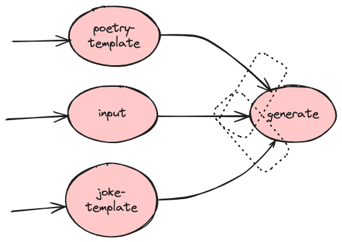

### Parallel and Waiting: How to Build a Brain with Parallel and Waiting Neurons 

- TrigLinks() or Entry() are for parallel triggering of links
- Links in a Cast group are also triggered in parallel after a Neuron is completed
- A Neuron begins its execution only after all the specified upstream Neurons have been completed. This is defined by setting up a trigger group to denote which upstream completions are to be awaited.

See the complete example here: [examples/flow-topology/parallel](./main.go)



```go
var (
    entryInput, entryPoetry, entryJoke string
)

func main() {
    bp := zenmodel.NewBrainPrint()
    bp.AddNeuron("input", inputFn)
    bp.AddNeuron("poetry-template", poetryFn)
    bp.AddNeuron("joke-template", jokeFn)
    bp.AddNeuron("generate", genFn)

    inputIn, _ := bp.AddLink("input", "generate")
    poetryIn, _ := bp.AddLink("poetry-template", "generate")
    jokeIn, _ := bp.AddLink("joke-template", "generate")

    entryInput, _ = bp.AddEntryLink("input")
    entryPoetry, _ = bp.AddEntryLink("poetry-template")
    entryJoke, _ = bp.AddEntryLink("joke-template")

    _ = bp.AddTriggerGroup("generate", inputIn, poetryIn)
    _ = bp.AddTriggerGroup("generate", inputIn, jokeIn)

    brain := bp.Build()

    // case 1: entry poetry and input
    // expect: generate poetry
    _ = brain.TrigLinks(entryPoetry)
    _ = brain.TrigLinks(entryInput)

    // case 2:entry joke and input
    // expect: generate joke
    //_ = brain.TrigLinks(entryJoke)
    //_ = brain.TrigLinks(entryInput)

    // case 3: entry poetry and joke
    // expect: keep blocking and waiting for any trigger group triggered
    //_ = brain.TrigLinks(entryPoetry)
    //_ = brain.TrigLinks(entryJoke)

    // case 4: entry only poetry
    // expect: keep blocking and waiting for any trigger group triggered
    //_ = brain.TrigLinks(entryPoetry)

    // case 5: entry all
    // expect: The first done trigger group triggered activates the generated Neuron,
    // and the trigger group triggered later does not activate the generated Neuron again.
    //_ = brain.Entry()

    brain.Wait()
}

func inputFn(b zenmodel.BrainRuntime) error {
    _ = b.SetMemory("input", "orange")
    return nil
}

func poetryFn(b zenmodel.BrainRuntime) error {
    _ = b.SetMemory("template", "poetry")
    return nil
}

func jokeFn(b zenmodel.BrainRuntime) error {
    _ = b.SetMemory("template", "joke")
    return nil
}

func genFn(b zenmodel.BrainRuntime) error {
    input := b.GetMemory("input").(string)
    tpl := b.GetMemory("template").(string)
    fmt.Printf("Generating %s for %s\n", tpl, input)
    return nil
}
```
