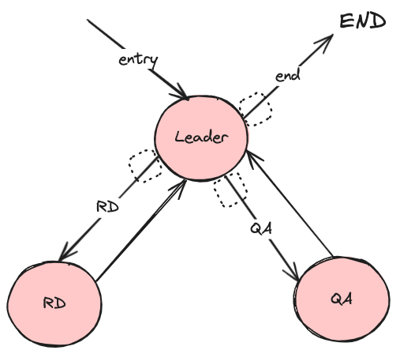

### Multi-Agent

Multi-agent systems consist of multiple decision-making agents that interact in a shared environment to achieve common or conflicting goals.

- [agent-supervisor](./main.go): An example of a multi-agent system with an agent supervisor to help delegate tasks. In the example, the Leader delegates tasks to RD (Research and Development) and QA (Quality Assurance), if the code doesn’t pass the test, it is sent back to RD for rewriting and then tested again, and the Leader makes corresponding decisions based on feedback, finally returning the tested code.

