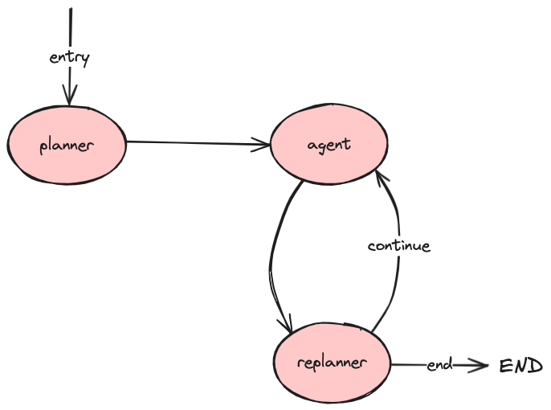

### Plan and Execute

The examples below implement a typical "plan and execute" style of agent architecture, where an LLM planner decomposes user requests into a program, an executor executes the program, and the LLM synthesizes responses (and/or dynamically replans) based on the program’s output.

- [Plan & Execute](./main.go): A simple agent with a Planner that generates a multistep task list, an Executing Agent that invokes tools from the plan, and a replanner that responds or creates an updated plan.

